# Trabajo Practico 1
**Alumnos:**  
Nahuel Arrieta  
Lucas Moyano

## Introducción
El presente informe corresponde al primer trabajo práctico de la materia "Procesamiento de Imágenes". En este trabajo se abordaron diferentes temas relacionados con la manipulación y compresión de imágenes, así como la conversión entre diferentes modos de color. Se realizaron ejercicios prácticos utilizando Python y las librerías OpenCV y scikit-image.
Para explicar las implementaciones, en cada consigna se encuentra parte del código utilizado para la resolución de los ejercicios. El código completo se encuentra en el notebook `TP 1/code/TP1.ipynb`. 

## Sección 1:  Modos de color en imagenes

### 6. **(*) La conversión de una imagen de color a escala de grises se puede hacer de varias formas. El ejercicio consiste en convertir la imagen de Lenna color a escala de grises utilizando diferentes metodos.**

#### a. **Usando la libreria cv2 y el metodo cvtColor()**
Usando `cv2.cvtColor()` el resultado es el siguiente:

```python
gray_image = cv2.cvtColor(image, cv2.COLOR_BGR2GRAY)
```


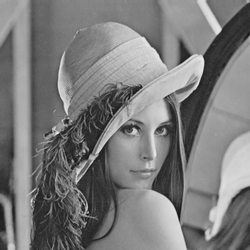

#### b. **Usando la fórmula de luminancia**
Utilizando la fórmula `L = 0.299 * R + 0.587 * G + 0.114 * B` (se ponderán los valores segun la percepción del ojo humano):

```python
luminance = 0.299 * red_channel + 0.587 * green_channel + 0.114 * blue_channel
luminance = np.clip(luminance, 0, 255).astype(np.uint8)
```

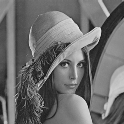

#### c. **Usando scickit-image y el método rgb2gray**
Utilizando `skimage.color.rgb2gray()` el resultado es el siguiente:

```python
image_gray = rgb2gray(image)
```


#### d. **¿Qué pasa con los canales?**

Ahora las imágenes solo tienen un único canal en lugar de tres. Mayor intensidad de gris significa que el pixel es más claro, mientras que menor intensidad significa que el pixel es más oscuro.

#### e. **¿Qué profundidad de bits tiene la imagen?**

Tienen una profundidad de 8 bits, lo que significa que cada canal puede tener 256 valores diferentes (0-255). 
Cuando la imagen es a color, cada canal (Rojo, Verde y Azul) tiene 8 bits, lo que da un total de 24 bits para la imagen en color. En el caso de la imagen en escala de grises, solo hay un canal, por lo que tiene 8 bits.

#### f. **Evaluar con otra imagen de mayor profundidad**


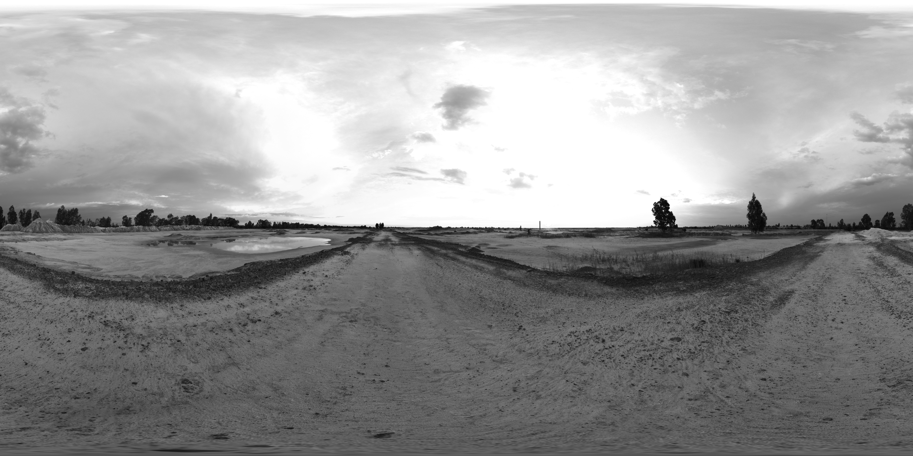

#### g. **¿Qué sucede con la imagen? ¿Ha cambiado algo?**

Al ojo humano, parece no haber diferencia entre una profundidad de bits de 8 y una de 16. Sin embargo, al convertir a escala de grises, la imagen de 16 bits tiene una mayor cantidad de tonos de gris, lo que puede ser útil para aplicaciones que requieren un rango dinámico más amplio. 

### 7. **(*) Convertir la imagen de Lenna a otros modos de color, como CMYK, HSV, HSL. Mostrar el resultado.**

A continuación se muestran las imágenes convertidas a los diferentes modos de color. Cabe destacar que las imágenes visualizadas se muestran en el espacio de color RGB, pero los valores de los píxeles corresponden a los diferentes espacios de color.

#### CMYK:
```python
image_cmyk = cv2.cvtColor(image, cv2.COLOR_BGR2RGB)  # Convert BGR to RGB first
image_cmyk = 255 - image_cmyk  # In CMYK, we subtract RGB values from 255
```

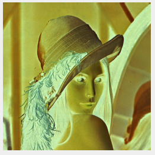

#### HSV:
```python
image_hsv = cv2.cvtColor(image, cv2.COLOR_BGR2HSV)
```
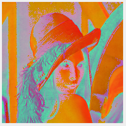

#### HSL:
```python
image_hsl = cv2.cvtColor(image, cv2.COLOR_BGR2HLS)
```

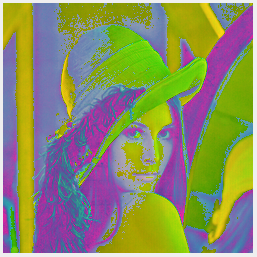


### 8. **(*) Tomar la imagen convertida en escala de grises y volver a convertir al en modo RGB. ¿Qué ha sucedido?**
```python
gray_image = cv2.cvtColor(image, cv2.COLOR_BGR2GRAY)
image_rgb = cv2.cvtColor(gray_image, cv2.COLOR_GRAY2BGR)
```

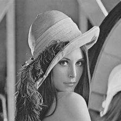  

Cuando se convirtió a escala de grises, se perdió información respectiva a la intensidad de cada color. Cuando volvemos a convertir a RGB, se aplica la misma información a todos los canales, perdiendo toda diferencia entre intensidad de colores. 


## Sección 2: Compresión de Imagenes


### 2. **(*) Dar detalles de las siguientes métricas de calidad de compresión (PSNR, SSIM)**

#### *PNSR  (Peak Signal-to-Noise Ratio)*  
El PSNR es una métrica utilizada para evaluar la calidad de una imagen comprimida en comparación con la imagen original. Se basa en la relación entre la potencia máxima de la señal (la imagen original) y la potencia del ruido (la diferencia entre la imagen original y la imagen comprimida).  
Se  calcula:  
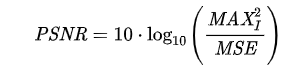  
Donde:  
- MAXI es el valor máximo de un píxel (para imágenes en escala de grises con 8 bits, MAXI  =255).
- MSE es el Mean Squared Error, que mide la diferencia promedio entre los píxeles de la imagen original y la imagen comprimida.

#### *SSIM (Structural Similarity Index)*  
El SSIM es una métrica más avanzada y perceptual que evalúa la calidad de una imagen teniendo en cuenta la estructura visual que es importante para el ojo humano. Mide las similitudes en la luminancia, el contraste y la estructura de las imágenes comparadas. Se calcula:  
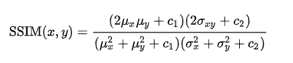  


### 6. **(*) Implementar un modelo de compresión basado en codificación Run-Length Encoding (RLE). El algoritmo Run-Length Encoding (RLE) reduce el tamaño de una imagen representando secuencias consecutivas de píxeles idénticos como una sola entrada. Para ello convertir una imagen en escala de grises. luego, implementar el algoritmo RLE para comprimir la imagen. Posteriormente, implementar una funcion para descomprimir la imagen. Al finalizar, mostrar la imagen original y la imagen reconstruida. Probar con dos o tres imagenes que tengan diferentes características, modos de color. Utilizar alguna de las metricas nombradas anteriormente e evaluar el resultado de la misma.**

Se implementó un algoritmo propio de compresión y descompresión utilizando RLE. Su metodo de compresión consiste en recorrer la imagen y contar la cantidad de píxeles consecutivos que tienen el mismo valor. Luego, se almacena el valor del píxel y la cantidad de veces que se repite. La descompresión consiste en recorrer la lista comprimida y reconstruir la imagen original utilizando los valores y las cantidades almacenadas.

```python
def run_length_enconde(img):
  encoded_img = []

  # First we iterate the image
  for row in range(img.shape[0]):
    encoded_img_row = []
    previous_pixel_value = img[row, 0]
    count = 0
    for col in range(img.shape[1]):
        pixel_value = img[row, col]
        if pixel_value == previous_pixel_value:
            count += 1

        else:
          encoded_img_row.append((previous_pixel_value, count))
          count = 1

        previous_pixel_value = pixel_value
    # This fixes bug of not appending last value
    encoded_img_row.append((previous_pixel_value, count))
    # Appends row
    encoded_img.append(encoded_img_row)
  return encoded_img
```

```python

def run_length_decode(img):
  decoded_img = []
  for row in range(len(img)):
    decoded_img_row = []
    for pixel_value, count in img[row]:
      for _ in range(count):
        decoded_img_row.append(pixel_value)

    decoded_img.append(decoded_img_row)
  return np.array(decoded_img, dtype=np.uint8)
```

Imagenes originales:  
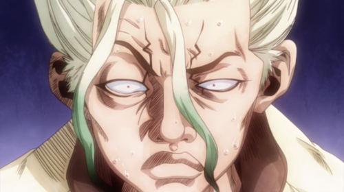
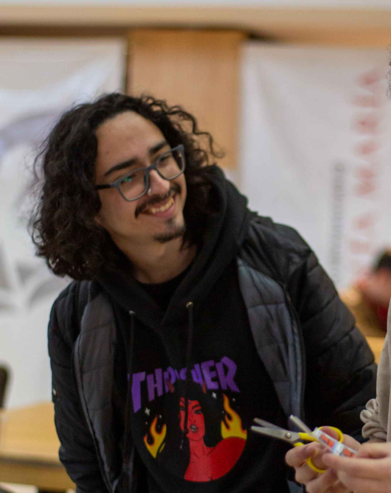  
Imagenes greyscale:  

  
Imagenes reconstruidas:  
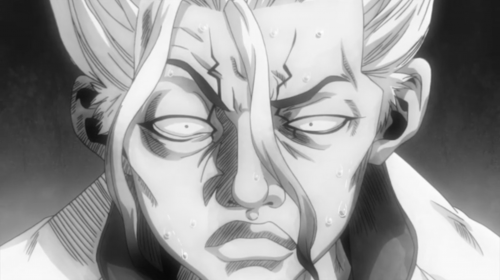


Utilizando PSNR notamos que nos da infinito, ya que las imagenes no pierden datos y son identicas.