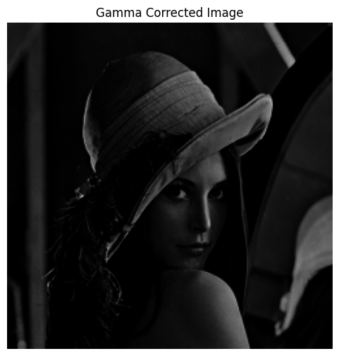

# Trabajo Practico 1
**Alumnos:**  
Nahuel Arrieta  
Lucas Moyano

## Sección 1: Histogramas

### 7. (*) Transformar la distribuci´on de intensidades de una imagen para que se parezca a la de otra. Implementar el ajuste de histograma usando OpenCV o skimage.exposure.match histograms(). Comparar los histogramas antes y despu´es del ajuste.
Se utilizó `exposure.match_histograms` de `skimage` para ajustar el histograma de la imagen 1 al de la imagen 2.

### 8. (*) Aplicar ecualizaci´on de histograma a una imagen en escala de grises. Comparar la imagen original con la ecualizada.
Se utilizó `cv2.equalizeHist` para ecualizar el histograma de la imagen. A continuación se muestran la imagen original y la ecualizada, y sus histogramas.

### 9. (*) Implementar una umbralizaci´on manual eligiendo un valor de umbral. Usar el m´etodo de Otsu para calcular un umbral ´optimo autom´aticamente.
Se implementó una función propia de umbralización manual y para el método de Otsu se utilizó `cv2.threshold` con el flag `cv2.THRESH_BINARY + cv2.THRESH_OTSU`.
A continuación se muestran los resultados de aplicar ambos métodos a la imagen Lenna.

### 11. (*) Implementar la transformaci´on gamma I’=I^y permitiendo ajustar el valor de y dinámicamente. Aplicar diferentes valores de y en distintas regiones de la imagen (por ejemplo, usando una m´ascara o adaptando y en funci´on del brillo local). Visualizar el efecto de la correcci´on gamma en la imagen y en su histograma.
Se implementó una función para aplicar la transformación gamma a la imagen. A continuación se muestra el resultado de aplicar diferentes valores de gamma a distintas regiones de la imagen.

Con un `y = 5` se logra un oscurecimiento de la imagen:

Con un `y = 0.2` se logra un aumento del brillo:

## Sección 2: Combinación de imagenes

### 3. (*) Multiplicación y división de imágenes: Multiplicar y divide dos imágenes píxel a píxel utilizando cv2.multiply() y cv2.divide(), observando cómo afecta el brillo y contraste.

Imagenes originales:  
  

Imagenes multiplicadas:  

Imagenes divididas:  

La primera imagen como se multiplica, el brillo es aumentado notoriamente y presenta un ligero contraste por el cual se puede ver la primera imagen original.  
Mientras que en la segunda imagen el brillo es disminuido llegando casi a 0 y presenta un contraste todavía menor al anterior casi invisible.

### 5. (*) Combinación con operadores lógicos: Usa operadores booleanos (cv2.bitwise and, cv2.bitwise or, cv2.bitwise xor) para fusionar imágenes basándose en una máscara binaria. Describir que sucede en cada caso

Mascara binaria utilizada:  
  

**Resultado de operación AND:**
  
Los colores se suman, por ende la hue cambia dependiendo de los dos colores que se sumen.  
**Resultado de operación OR:**  
  
El brillo es aumentado en toda la imagen menos en la mascara binaria.  
**Resultado de operación XOR:**  
  
Pareciera un efecto parecido al de invertir colores, las montañas que eran oscuras son ahora blancas, mientras que la nieve que era blanca es ahora oscura.

### 8. (*) Uso de operadores lógicos para reemplazar partes de una imagen: Reemplazar un área específica de una imagen con otra utilizando operadores lógicos y relacionales para definir la región de interés (ROI).

Imagenes utilizadas:  

Remplazamos el pelo y el uniforme del chico con el efecto de la segunda imagen  

Aplicamos umbralización a la primera imagen:  
  

La invertimos con el operador NOT:  
  

Agregamos el efecto con un AND con la mascara invertida:  

Usamos maximo para terminar uniendo la imagen original con la anterior:  
  

## Sección 3: Dominio espacial

### 8. Suavizado y Sobel (*): Aplicar un filtro gaussiano antes del operador de Sobel y analizar las diferencias en la detección de bordes.

Sobel:  

Sobel con gaussiano:  

Notamos que los bordes ya no están tan definidos como cuando aplicamos sobel a la imagen original, son más gruesos y menos detallados.

### 12. (*) Comparación de Métodos de Detección de Bordes : Comparar Sobel, Prewitt, Laplace y Canny trabajando diversas imágenes con características diferentes.

Imagen original:  
  
Sobel:  
  
Prewitt:  
  
Laplace:  
  
Canny:  
  

Imagen original:  
  
Sobel:  
  
Prewitt:  
  
Laplace:  
  
Canny:  
  

Imagen original:  
  
Sobel:  
  
Prewitt:  
  
Laplace:  
  
Canny:  
  

Observando las imagenes podemos observar como todos los filtros son más buenos cuando se trata de un dibujo, ya que en general los bordes están mucho mejor definidos.  

En una fotografía el que pudo detectar mejor los bordes fue Sobel, pero probablemente con diferentes parametros se puede mejorar el resultado con canny.

### 13. (*) Realce de Detalles: Aplicar un filtro de paso alto y sumarlo a la imagen original para mejorar los detalles.

Imagen original:  
  
Canny aplicado:  
  
Sumados:  
  

### 15. (*) Filtro de Diferencia Gaussiana (DoG): Aplicar la técnica de Diferencia de Gaussiana para resaltar bordes.

Diferencia gaussiana:  
