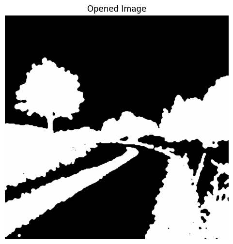
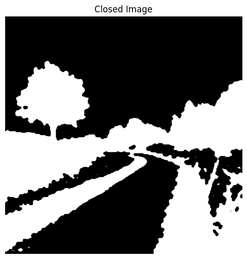
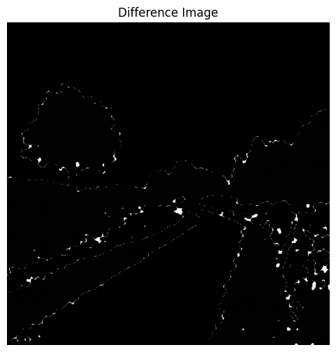
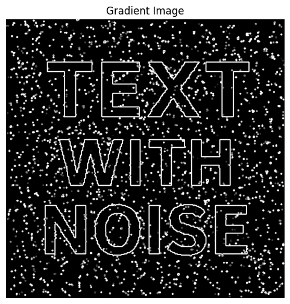
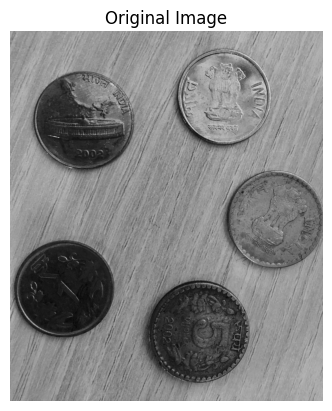
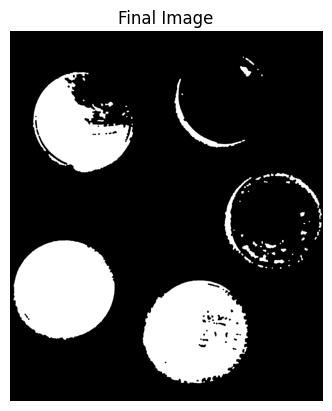

# Trabajo Practico 3
**Alumnos:**  
Nahuel Arrieta  
Lucas Moyano

## Sección 1: Operadores morfologicos

### 4. (*) Apertura y clausura morfológica: Aplicar apertura y clausura para eliminar ruido o cerrar huecos. Comparar la imagen original y la resultante de aplicar el operador. Comentar los efectos visuales. Comparar con los resultados anteriores. Mostrar 4 subplots: original, apertura, cierre, diferencia entre ambos.

Se implementaron funciones propias de apertura y clausura morfológica utilizando las funciones `cv2.dilate` y `cv2.erode`. A continuación se muestran los resultados de aplicar ambos operadores a la imagen original, junto con la diferencia entre ellos.

### 5. (*) Operación de gradiente morfológico: Aplicar el gradiente morfológico (dilatación - erosión). Visualizar los bordes obtenidos mediante esta operación.
Se implementó una función propia de gradiente morfológico que ejecuta las funciones `cv2.dilate`, `cv2.erode` y `cv2.absdiff`. A continuación se muestran los resultados de aplicar el operador a la imagen original.

### 7. (*) Segmentación básica con umbral + morfología: Aplicar umbral, luego apertura y cierre para mejorar el resultado. Ideal como paso previo a una segmentación más elaborada
A la imágen original se le aplicó un umbral, luego se aplicó apertura y cierre morfológico. A continuación se muestran los resultados de aplicar el operador a la imagen original.

