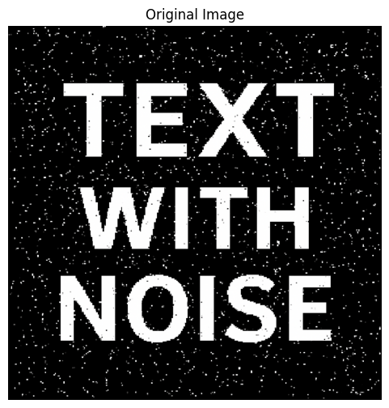

# Trabajo Practico 3
**Alumnos:**  
Nahuel Arrieta  
Lucas Moyano

## Introducción
El presente informe corresponde al tercer trabajo práctico de la materia "Procesamiento de Imágenes". En este trabajo se abordaron diferentes temas relacionados con la morfología matemática, incluyendo la apertura y clausura morfológica, el gradiente morfológico y la segmentación básica. Se realizaron ejercicios prácticos utilizando Python y las librerías OpenCV y scikit-image.
Para explicar las implementaciones, en cada consigna se encuentra parte del código utilizado para la resolución de los ejercicios. El código completo se encuentra en el notebook `TP 3/code/TP3.ipynb`.

## Sección 1: Operadores morfologicos

### 4. (*) Apertura y clausura morfológica: Aplicar apertura y clausura para eliminar ruido o cerrar huecos. Comparar la imagen original y la resultante de aplicar el operador. Comentar los efectos visuales. Comparar con los resultados anteriores. Mostrar 4 subplots: original, apertura, cierre, diferencia entre ambos.

Se implementaron funciones propias de apertura y clausura morfológica utilizando las funciones `cv2.dilate` y `cv2.erode`. A continuación se muestran los resultados de aplicar ambos operadores a la imagen original, junto con la diferencia entre ellos.

```python
def closing(image, kernel):
    # Perform closing operation using dilation followed by erosion
    dilated = cv2.dilate(image, kernel, iterations=1)
    closed = cv2.erode(dilated, kernel, iterations=1)
    return closed
```

```python
def opening(image, kernel):
    # Perform opening operation using erosion followed by dilation
    eroded = cv2.erode(image, kernel, iterations=1)
    opened = cv2.dilate(eroded, kernel, iterations=1)
    return opened
```

```python
## Apply opening
opened_image = opening(image, kernel)

## Apply closing
closed_image = closing(image, kernel)

## Calculate the difference
difference = cv2.absdiff(opened_image, closed_image)
```


### 5. (*) Operación de gradiente morfológico: Aplicar el gradiente morfológico (dilatación - erosión). Visualizar los bordes obtenidos mediante esta operación.
Se implementó una función propia de gradiente morfológico que ejecuta las funciones `cv2.dilate`, `cv2.erode` y `cv2.absdiff`. A continuación se muestran los resultados de aplicar el operador a la imagen original.

```python
def morphological_gradient(image, kernel):
    # Perform morphological gradient using dilation and erosion
    dilated = cv2.dilate(image, kernel, iterations=1)
    eroded = cv2.erode(image, kernel, iterations=1)
    gradient = cv2.absdiff(dilated, eroded)
    return gradient
```




### 7. (*) Segmentación básica con umbral + morfología: Aplicar umbral, luego apertura y cierre para mejorar el resultado. Ideal como paso previo a una segmentación más elaborada
A la imágen original se le aplicó un umbral, luego se aplicó apertura y cierre morfológico. A continuación se muestran los resultados de aplicar el operador a la imagen original.

```python
## Apply grayscale conversion
image = cv2.cvtColor(image, cv2.COLOR_BGR2GRAY)

## Apply thresholding
_, image = cv2.threshold(image, 0, 255, cv2.THRESH_BINARY + cv2.THRESH_OTSU)
image = cv2.bitwise_not(image)

## Opening
kernel = create_kernel(circle_kernel, 10)
image = opening(image, kernel)

## Closing
kernel = create_kernel(circle_kernel, 10)
image = closing(image, kernel)
```


