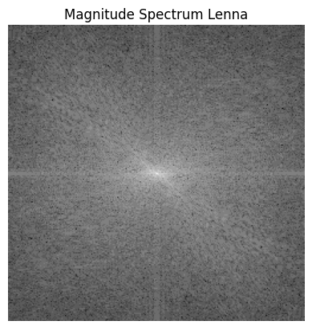
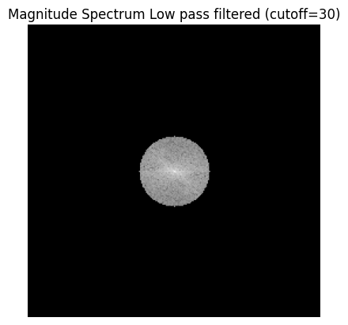
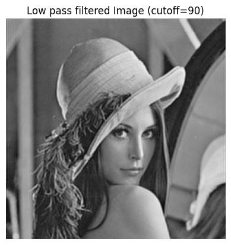
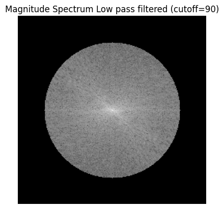
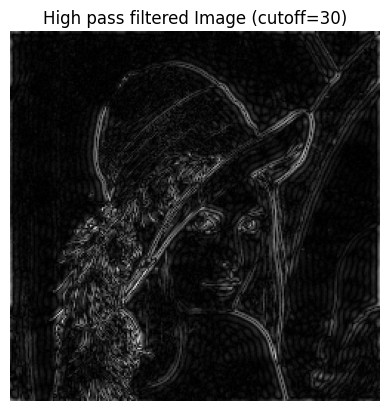
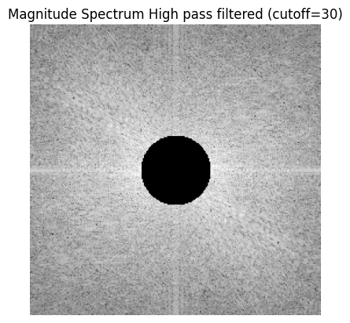
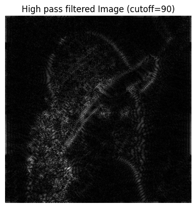
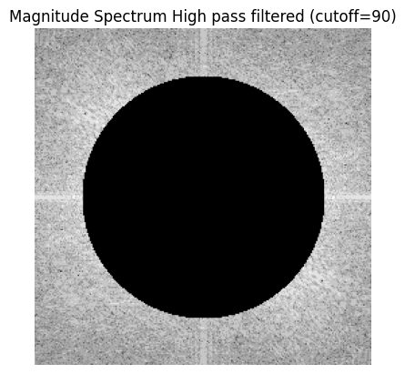

# Trabajo Practico 4
**Alumnos:**  
Nahuel Arrieta  
Lucas Moyano

## Introducción
El presente informe corresponde al cuarto trabajo de la materia "Procesamiento de Imágenes". En el mismo, se abordan ejercicios relacionadas a la Trasnformada Discreta de Fourier (DFT) aplicada a imágenes. Se busca analizar la frecuencia de las imágenes y su representación en el dominio de la frecuencia.
Para explicar las implementaciones, en cada consigna se encuentra parte del código utilizado para la resolución de los ejercicios. El código completo se encuentra en el notebook `TP 2/code/TP2.ipynb`.

## Sección 1: Transformada de Fourier
### 10. (*) Responder las siguientes preguntas. Tratar de utilizar dos im´agenes en aquellos ejercicios que no soliciten algo particular. Utilizar una imagen que muestre frecuencias bajas en su mayor´ıa y otras con mayor´ıa de frecuencias altas. Por cada pregunta se ha agregado una sugerencia de como realizar el ejercicio practico para acompa˜nar su respuesta.

### 11. Transformada de Fourier inversa: Realiza la transformada de Fourier inversa para recuperar la imagen original a partir de su versi´on filtrada en el dominio frecuencial. Compara la imagen original con la imagen recuperada.

```python
def fourier_transform(image, shift=True):
    ## Convert to grayscale
    if len(image.shape) == 3:
        # Convert to grayscale if the image is in color
        image = cv2.cvtColor(image, cv2.COLOR_BGR2GRAY)

    ## Apply Fourier Transform
    f_transform = np.fft.fft2(image)

    ## Shift the zero frequency component to the center
    if shift:
        f_transform = np.fft.fftshift(f_transform)

    ## Calculate the magnitude spectrum
    magnitude = np.abs(f_transform)

    ## Calculate the phase spectrum
    phase = np.angle(f_transform)
    
    return magnitude, phase
``` 

```python
def inverse_fourier_transform(magnitude, phase):
    # Reconstruct the complex spectrum
    f_reconstructed = magnitude * np.exp(1j * phase)

    # Shift the zero frequency component back to the original position
    f_reconstructed = np.fft.ifftshift(f_reconstructed)

    # Apply inverse Fourier Transform
    image_reconstructed_complex = np.fft.ifft2(f_reconstructed)

    # Get the real part (or absolute value)
    image_reconstructed = np.abs(image_reconstructed_complex)

    # Normalize the image to the range [0, 255]
    image_reconstructed = cv2.normalize(image_reconstructed, None, 0, 255, cv2.NORM_MINMAX)

    return np.uint8(image_reconstructed)
```

#### (a) ¿C´omo se visualiza la diferencia entre las frecuencias altas y bajas en una imagen? Ejercicio sugerido: Aplicar la Transformada de Fourier (DFT) y mostrar la magnitud del espectro centrado con fftshift.
Cuando aplicamos la DFT a una imagen, las frecuencias bajas corresponden a las componentes de baja variación en la imagen, como áreas homogéneas o suaves. Por otro lado, las frecuencias altas representan detalles finos y bordes. Al visualizar la magnitud del espectro centrado con `fftshift`, podemos observar que las frecuencias bajas se encuentran en el centro del espectro, mientras que las frecuencias altas están en los bordes. 

En el espectro podemos ver la magnitud de cada frecuencia, es decir, la cantidad de energía que tiene cada frecuencia en la imagen. Mientrás más blanco sea el pixel, más energía tiene esa frecuencia. 

Por ejemplo:





#### (b) ¿Qu´e ocurre si eliminamos las componentes de alta frecuencia de una imagen? ¿Y si eliminamos las de baja frecuencia? Ejercicio sugerido: Aplicar filtros pasa bajos y pasa altos en el dominio de la frecuencia y reconstruir la imagen con la transformada inversa.

Si eliminamos las componentes de alta frecuencia de una imagen, la imagen resultante se verá más suave y menos detallada, ya que estamos eliminando los bordes y detalles finos. Esto se traduce en una imagen más borrosa. Por otro lado, si eliminamos las componentes de baja frecuencia, la imagen resultante tendrá un aspecto más ruidoso y con más detalles, pero perderá la información de las áreas homogéneas.

En los siguientes ejemplos se aplicarion filtros ideales (circulos con radio cutoff) a la imagen de Lenna. En el caso del filtro pasa bajo, se eliminan las frecuencias altas (fuera del circulo), mientras que en el caso del filtro pasa alto, se eliminan las frecuencias bajas (dentro del circulo).


Filtros de paso bajo:








Filtros de paso alto:








