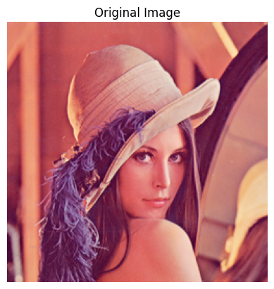
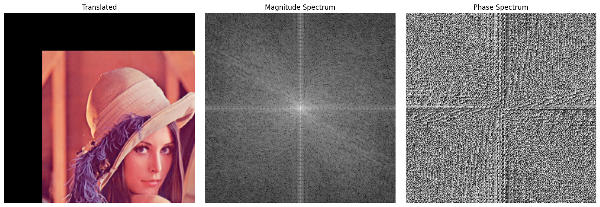

# Trabajo Practico 4
**Alumnos:**  
Nahuel Arrieta  
Lucas Moyano

## Introducción
El presente informe corresponde al cuarto trabajo de la materia "Procesamiento de Imágenes". En el mismo, se abordan ejercicios relacionadas a la Trasnformada Discreta de Fourier (DFT) aplicada a imágenes. Se busca analizar la frecuencia de las imágenes y su representación en el dominio de la frecuencia.
Para explicar las implementaciones, en cada consigna se encuentra parte del código utilizado para la resolución de los ejercicios. El código completo se encuentra en el notebook `TP 4/code/TP 4.ipynb`.

## Sección 1: Transformada de Fourier
### 10. (*) Responder las siguientes preguntas. Tratar de utilizar dos imágenes en aquellos ejercicios que no soliciten algo particular. Utilizar una imagen que muestre frecuencias bajas en su mayoría y otras con mayoría de frecuencias altas. Por cada pregunta se ha agregado una sugerencia de como realizar el ejercicio practico para acompa˜nar su respuesta.

### 11. Transformada de Fourier inversa: Realiza la transformada de Fourier inversa para recuperar la imagen original a partir de su versión filtrada en el dominio frecuencial. Compara la imagen original con la imagen recuperada.

```python
def fourier_transform(image, shift=True):
    ## Convert to grayscale
    if len(image.shape) == 3:
        # Convert to grayscale if the image is in color
        image = cv2.cvtColor(image, cv2.COLOR_BGR2GRAY)

    ## Apply Fourier Transform
    f_transform = np.fft.fft2(image)

    ## Shift the zero frequency component to the center
    if shift:
        f_transform = np.fft.fftshift(f_transform)

    ## Calculate the magnitude spectrum
    magnitude = np.abs(f_transform)

    ## Calculate the phase spectrum
    phase = np.angle(f_transform)
    
    return magnitude, phase
``` 

```python
def inverse_fourier_transform(magnitude, phase):
    # Reconstruct the complex spectrum
    f_reconstructed = magnitude * np.exp(1j * phase)

    # Shift the zero frequency component back to the original position
    f_reconstructed = np.fft.ifftshift(f_reconstructed)

    # Apply inverse Fourier Transform
    image_reconstructed_complex = np.fft.ifft2(f_reconstructed)

    # Get the real part (or absolute value)
    image_reconstructed = np.abs(image_reconstructed_complex)

    # Normalize the image to the range [0, 255]
    image_reconstructed = cv2.normalize(image_reconstructed, None, 0, 255, cv2.NORM_MINMAX)

    return np.uint8(image_reconstructed)
```

#### (a) ¿Cómo se visualiza la diferencia entre las frecuencias altas y bajas en una imagen? Ejercicio sugerido: Aplicar la Transformada de Fourier (DFT) y mostrar la magnitud del espectro centrado con fftshift.
Cuando aplicamos la DFT a una imagen, las frecuencias bajas corresponden a las componentes de baja variación en la imagen, como áreas homogéneas o suaves. Por otro lado, las frecuencias altas representan detalles finos y bordes. Al visualizar la magnitud del espectro centrado con `fftshift`, podemos observar que las frecuencias bajas se encuentran en el centro del espectro, mientras que las frecuencias altas están en los bordes. 

En el espectro podemos ver la magnitud de cada frecuencia, es decir, la cantidad de energía que tiene cada frecuencia en la imagen. Mientrás más blanco sea el pixel, más energía tiene esa frecuencia. 

Por ejemplo:




#### (b) ¿Qué ocurre si eliminamos las componentes de alta frecuencia de una imagen? ¿Y si eliminamos las de baja frecuencia? Ejercicio sugerido: Aplicar filtros pasa bajos y pasa altos en el dominio de la frecuencia y reconstruir la imagen con la transformada inversa.

Si eliminamos las componentes de alta frecuencia de una imagen, la imagen resultante se verá más suave y menos detallada, ya que estamos eliminando los bordes y detalles finos. Esto se traduce en una imagen más borrosa. Por otro lado, si eliminamos las componentes de baja frecuencia, la imagen resultante tendrá un aspecto más ruidoso y con más detalles, pero perderá la información de las áreas homogéneas.

El código para aplicar filtros pasa bajos y pasa altos es el siguiente:

```python
def ideal_high_pass_filter(magnitude, cutoff):
    # Create a mask with the same shape as the magnitude spectrum
    rows, cols = magnitude.shape
    center_row, center_col = rows // 2, cols // 2
    y, x = np.ogrid[:rows, :cols]
    mask = (x - center_col) ** 2 + (y - center_row) ** 2 >= cutoff ** 2

    # Apply the mask to the magnitude spectrum
    filtered_magnitude = magnitude * mask

    return filtered_magnitude
```

```python
def ideal_low_pass_filter(magnitude, cutoff):
    # Create a mask with the same shape as the magnitude spectrum
    rows, cols = magnitude.shape
    center_row, center_col = rows // 2, cols // 2
    y, x = np.ogrid[:rows, :cols]
    mask = (x - center_col) ** 2 + (y - center_row) ** 2 <= cutoff ** 2

    # Apply the mask to the magnitude spectrum
    filtered_magnitude = magnitude * mask

    return filtered_magnitude
```


En los siguientes ejemplos se aplicarion filtros ideales (circulos con radio cutoff) a la imagen de Lenna. En el caso del filtro pasa bajo, se eliminan las frecuencias altas (fuera del circulo), mientras que en el caso del filtro pasa alto, se eliminan las frecuencias bajas (dentro del circulo).


Filtros de paso bajo:


Filtros de paso alto:


### (c) ¿Qué representa la fase de la transformada de Fourier de una imagen? ¿Qué ocurre si se conserva solo la fase o solo la magnitud? Ejercicio sugerido: Reconstruir una imagen usando solo la magnitud y fase de otra imagen, intercambiar fase y magnitud entre dos imágenes distintas.

La fase de la transformada de Fourier de una imagen representa el desplazamiento de cada una de las frecuencias. 

Si se conserva solo la fase y se descarta la magnitud, la imagen reconstruida sigue mostrando la estructura y formas reconocibles, aunque con contraste distorsionado. 

En cambio, si se conserva solo la magnitud y se elimina la fase, la imagen reconstruida pierde su estructura y se vuelve irreconocible, pareciendo una niebla borrosa. 

En el siguiente ejemplo se intercambiaron la fase y la magnitud entre dos imágenes distintas. 

Imagen 1:


Imagen 2:


Imagenes reconstruidas:


### (d) ¿Por qué se centra la transformada de Fourier para su visualización? ¿Qué efecto tiene? Ejercicio sugerido: Mostrar el espectro de magnitud con y sin aplicar fftshift.
Se centra la transformada de Fourier usando fftshift para facilitar su visualización, ya que por defecto el componente de frecuencia cero (las bajas frecuencias) queda en la esquina superior izquierda, lo que resulta poco intuitivo. Al centrarla, las bajas frecuencias se ubican en el centro y las altas en los bordes, permitiendo una interpretación más clara del contenido espectral y facilitando el diseño de filtros. Esta operación no altera los datos originales, solo reorganiza su disposición para hacerla más comprensible.


### (e)  ¿Cómo se comporta la transformada de Fourier ante la traslación o rotación de una imagen? Ejercicio sugerido: Aplicar una traslación o rotación y comparar los espectros de magnitud y fase antes y después.

Cuando se traslada una imagen, la teoría dice que solo debería cambiar la fase del espectro de Fourier, mientras que la magnitud debería mantenerse igual. Sin embargo, en los experimentos realizados, al trasladar la imagen con cv2.warpAffine, se generan bordes negros en las zonas que quedan vacías. Estos bordes introducen nuevos detalles en la imagen que afectan el resultado, por lo que la magnitud también cambia. En cambio, al aplicar una rotación, el espectro de Fourier se rota en el mismo ángulo que la imagen, conservando su forma. Esto se puede ver claramente en las imágenes comparadas.

imagen original:


imagen rotada 45°:


imagen rotada 90°:


imagen trasladada:




### (f) ¿Cómo se refleja una estructura periódica en el dominio frecuencial? Ejercicio sugerido: Usar imágenes sintéticas (rejillas, líneas) y observar cómo se representan sus frecuencias dominantes

Cuando analizamos la transformada de Fourier de una imagen con estructuras periódicas, como rejillas o líneas, observamos que estas estructuras generan picos con estructuras periódicas en el espectro de magnitud y de fase. 
Dependiendo de la estrucutra de la imagen sintética, los picos pueden aparecer en diferentes posiciones del espectro. Por ejemplo, una rejilla regular genera picos en posiciones equidistantes, mientras que circunferencias generan picos en posiciones radiales.

Lineas verticales:


Lineas diagonales:


Circunferencias:


### (g) ¿Qué diferencias se observan en el espectro de imágenes suaves vs. imágenes con bordes pronunciados? Ejercicio sugerido: Comparar el espectro de una imagen desenfocada vs. la original con bordes definidos.

Las imágenes suaves, como las desenfocadas, tienen un espectro de Fourier que muestra una concentración de energía en las frecuencias bajas, ya que carecen de detalles finos y bordes pronunciados. 

En contraste, las imágenes con bordes definidos presentan un espectro con una mayor presencia de frecuencias altas, lo que indica la existencia de detalles y cambios abruptos en la intensidad de los píxeles.

imagen original:


imagen desenfocada:


### (h) ¿Qué ocurre si aplicamos un filtro de forma circular o rectangular en el espectro? ¿Cómo cambia la imagen? Ejercicio sugerido: Implementar máscaras ideales de paso bajo y paso alto circulares y cuadradas y observar sus efectos.

Al aplicar un filtro de forma circular o rectangular en el espectro de Fourier, se eliminan ciertas frecuencias de la imagen. Los filtros de paso bajo eliminan las frecuencias altas, suavizando la imagen y eliminando detalles finos. Esto resulta en una imagen más borroas.


### (i) ¿Cuál es la relación entre el patrón de una imagen (orientación, repetición) y la simetría del espectro? Ejercicio sugerido: Usar imágenes diagonales o repetitivas y analizar la simetría del espectro.

La relación entre el patrón de una imagen y la simetría del espectro de Fourier es directa. Las imágenes con patrones repetitivos o con una orientación específica generan simetrías en el espectro. Por ejemplo, una imagen con líneas diagonales produce un espectro que muestra simetría en torno a las diagonales del plano de frecuencia.

Lineas diagonales:


Circunferencias:


### (j) ¿Cómo puede usarse el dominio frecuencial para eliminar ruido periódico en una imagen? Ejercicio sugerido: Introducir ruido periódico artificialmente y dise˜nar un filtro para suprimirlo en el dominio de la frecuencia.

El dominio frecuencial es útil para eliminar ruido periódico en una imagen, ya que el ruido periódico se manifiesta como picos en el espectro de Fourier. Al diseñar un filtro que atenúe o elimine estas frecuencias específicas, podemos suprimir el ruido y recuperar la imagen original.

La implementación elimina ruido periodico en forma de lineas verticales. Consiste en encontrar picos ubicados en el eje vertical del espectro de Fourier y aplicar un filtro gaussiano para atenuar esas frecuencias.

```python
from scipy.signal import find_peaks

def gaussian_notch_filter(shape, centers, sigma=5):
    M, N = shape
    U, V = np.meshgrid(np.arange(N), np.arange(M))
    notch_mask = np.ones((M, N), dtype=np.float32)

    for (u0, v0) in centers:
        D2 = (V - u0)**2 + (U - v0)**2
        gaussian = np.exp(-D2 / (2 * sigma**2))
        notch_mask *= (1 - gaussian)

    return notch_mask

def remove_horizontal_noise(magnitude, phase, sigma=5, threshold_factor=2):
    M, N = magnitude.shape
    center_u, center_v = M // 2, N // 2

    # Projection over the vertical axis
    vertical_profile = magnitude[:, center_v].copy()
    vertical_profile[center_u - 5:center_u + 5] = 0  # Ignore the center frequency

    # Detect peakss
    threshold = vertical_profile.mean() + threshold_factor * vertical_profile.std()
    peaks, _ = find_peaks(vertical_profile, height=threshold)

    # Calculate the center of the peaks
    centers = [(u, center_v) for u in peaks] + [(M - u, center_v) for u in peaks]

    # Create the notch filter
    notch_mask = gaussian_notch_filter((M, N), centers, sigma=sigma)

    # Apply the notch filter to the magnitude spectrum
    filtered_magnitude = magnitude * notch_mask

    return filtered_magnitude, phase
```

Los resultados fueron los siguientes:


Luego de aplicar el filtro, se reconstruyó la imagen y se comparó con la original:


