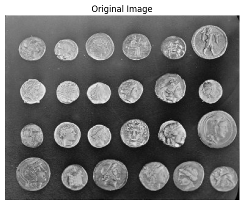
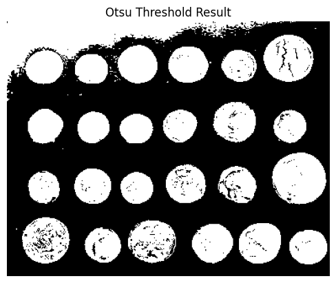
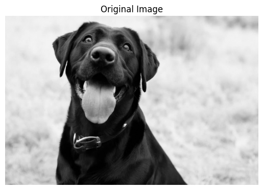
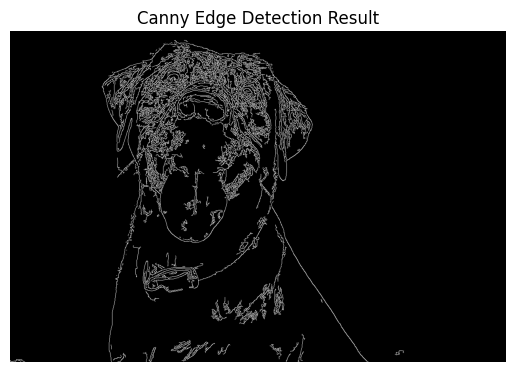
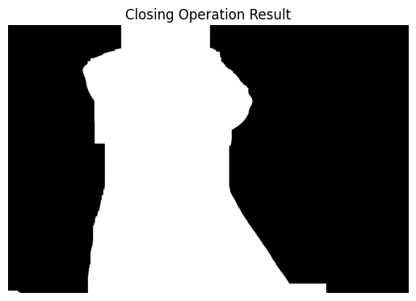
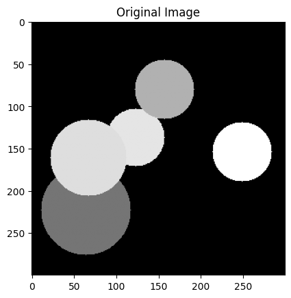
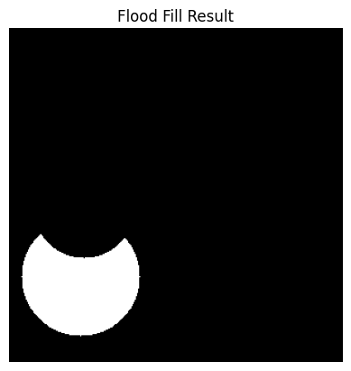
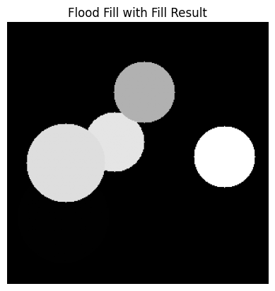
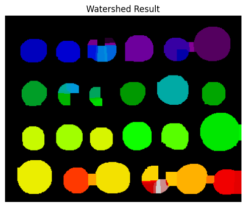

# Trabajo Practico 5
**Alumnos:**  
Nahuel Arrieta  
Lucas Moyano

## Introducción
El presente informe corresponde al quinto trabajo de la materia "Procesamiento de Imágenes". En el mismo, se abordan ejercicios relacionados a la segmentación de imagenes.
Para explicar las implementaciones, en cada consigna se encuentra parte del código utilizado para la resolución de los ejercicios. El código completo se encuentra en el notebook `TP5/code/tp5.ipynb`.

### 3. Umbralización híbrida (combinación de Otsu + morfología). ¿Cómo mejorar la segmentación de objetos con ruido o regiones conectadas? Práctica sugerida: Aplicar Otsu, luego refinar con cv2.morphologyEx() (apertura o cierre).

```python
image = skimage.data.coins()
plt.imshow(image, cmap='gray')
plt.title("Original Image")
plt.axis('off')
plt.show()

threshold = skimage.filters.threshold_otsu(image)
binary = image > threshold  # binary is a 2D boolean array

# Display
plt.imshow(binary, cmap='gray')  # 'gray' colormap for binary images
plt.title("Otsu Threshold Result")
plt.axis('off')
plt.show()

# Define kernel
kernel = np.ones((5, 5), np.uint8)

morphed = cv2.morphologyEx((binary * 255).astype(np.uint8), cv2.MORPH_CLOSE, kernel)
# Display the result of morphological operation
plt.imshow(morphed, cmap='gray')
plt.title("Morphological Operation (close) Result")
plt.axis('off')
plt.show()
```


Imagen original:  

Resultados:  
  
  

Aplicamos umbralización Otsu a la imagen y notamos que obtenemos buenos resultados en terminos de segmentación pero quedan algunas manchas adentros de la moneda, que en realidad son huecos.

Como son huecos sabemos que la operación morfologica más adecuada para rellenar huecos es la clausura. Aplicamos entonces la clausura y obtenemos un buen resultado.

### 4. (*) Segmentación por detección de bordes. ¿Cómo se puede usar la información de bordes para segmentar una imagen? Práctica sugerida: Detectar bordes con cv2.Canny() o skimage.filters.sobel, luego aplicar umbral y cerrar regiones con morfología.

```python
grey_dog = cv2.imread('img/blackDog2.png', cv2.IMREAD_GRAYSCALE)

# Display the original image
plt.imshow(grey_dog, cmap='gray')
plt.title("Original Image")
plt.axis('off')
plt.show()

canny_dog = cv2.Canny(grey_dog, 10, 100)
# Display the Canny edge detection result
plt.imshow(canny_dog, cmap='gray')
plt.title("Canny Edge Detection Result")
plt.axis('off')
plt.show()


# Apply morphological operations
kernel_dog = np.ones((125, 125), np.uint8)
morphed_dog = cv2.morphologyEx(canny_dog, cv2.MORPH_CLOSE, kernel_dog)
# Display the result of morphological operation
plt.imshow(morphed_dog, cmap='gray')
plt.title("Closing Operation Result")
plt.axis('off')
plt.show()
```

imagen original:  
  
resultado:  
  



Aplicamos canny como consigna y obtenemos la silueta del perro y también algunos detalles internos que nos van a servir a rellenar la mascara con morfología.

Después intentamos obtener la imagen segmentada con una operación de clausura sobre la imagen canny. Obtenemos una segmentación pero es muy cuadrada ya que el kernel que se tuvo que utilizar para crearla tuvo que ser bastante grande.

Usar canny y morfología no parece ser una buena combinación para obtener la segmentación de una imagen.

## 8. (*) Segmentación basada en regiones (crecimiento o split-merge). ¿Cómo se puede segmentar una imagen expandiendo regiones homogéneas? Práctica sugerida: Usar skimage.segmentation.flood() o flood fill() para realizar crecimiento de regiones desde semillas.

```python
# we load img with skimage
image = skimage.io.imread('img/img_grises2.png', as_gray=True)
# Show it
plt.imshow(image, cmap='gray')
plt.title("Original Image")
plt.show()

seed = (250, 50)  # Initial seed point

flooded = skimage.segmentation.flood(image, seed, tolerance=0.5)
# Display the result of flood fill
plt.imshow(flooded, cmap='gray')
plt.title("Flood Fill Result")
plt.axis('off')
plt.show()

flooded_filled = skimage.segmentation.flood_fill(image, seed, 1, tolerance=0.5)
# Display the result of flood fill with fill
plt.imshow(flooded_filled, cmap='gray')
plt.title("Flood Fill with Fill Result")
plt.axis('off')
plt.show()
```

imagen original:  
  
resultados:  
  
  

Logramos dividir un circulo de todos los otros que están solapados, por ende flood es un algoritmo muy bueno cuando tenemos bordes bien definidos como en pixelart o dibujos. Vemos también que se puede usar para borrar la parte segmentada con flood fill de 1.


### 10. (*) Segmentación por combinación de técnicas (pipeline) Pregunta: ¿Qué beneficios tiene combinar varias técnicas de segmentación en un mismo flujo de procesamiento? Práctica sugerida: Aplicar primero Canny + morfología para generar una máscara, luego segmentar con Watershed o K-means sobre la región recortada.

```python
image = skimage.data.coins()

# Show it
plt.imshow(image, cmap='gray')
plt.title("Original Image")
plt.axis('off')
plt.show()

# apply canny
canny = cv2.Canny(image, 100, 200)
# Display the Canny edge detection result
plt.imshow(canny, cmap='gray')
plt.title("Canny Edge Detection Result")
plt.axis('off')
plt.show()

# apply morphology
kernel = np.ones((12, 12), np.uint8)
morphed = cv2.morphologyEx(canny, cv2.MORPH_CLOSE, kernel)
# Display the result of morphological operation
plt.imshow(morphed, cmap='gray')
plt.title("Morphological Operation Result")
plt.axis('off')
plt.show()

# apply open operation
morphed_open = cv2.morphologyEx(morphed, cv2.MORPH_OPEN, kernel)
# Display the result of morphological open operation
plt.imshow(morphed_open, cmap='gray')
plt.title("Morphological Open Operation Result")
plt.axis('off')
plt.show()

# apply watershed
distance = ndi.distance_transform_edt(morphed_open)
# Get coordinates of local maxima
coordinates = skimage.feature.peak_local_max(distance, labels=morphed_open)
# Create a mask of local maxima
local_max = np.zeros_like(distance, dtype=bool)
local_max[tuple(coordinates.T)] = True
markers = ndi.label(local_max)[0]
labels = skimage.segmentation.watershed(-distance, markers, mask=morphed_open)
# Display the result of watershed
plt.imshow(labels, cmap='nipy_spectral')
plt.title("Watershed Result")
plt.axis('off')
plt.show()
```

imagen original:  
    
resultados:  
  

Vemos que a watershed le cuesta segmentar bien las monedas, esto es debido a quel el pipeline indicado por la cosigna en mi opinion no es el mejor.
Lo que se realizó fue canny para detectar bordes, clausura para cerrar bordes, apertura para separar las monedas y watershed para segmentarlas.

Yo usaría umbralización y una clausura en vez de canny como vimos anteriormente para obtener un resultado más pulido.