# Trabajo Practico 6
**Alumnos:**  
Nahuel Arrieta  
Lucas Moyano

## Introducción
El presente informe corresponde al sexto trabajo de la materia "Procesamiento de Imágenes". En el mismo, se abordan ejercicios relacionadas a la detección de patrones en imágenes, abarcando técnicas de representación y descripción de características, y el reconocimiento de patrones.

Para explicar las implementaciones, en cada consigna se encuentra parte del código utilizado para la resolución de los ejercicios. El código completo se encuentra en el notebook `TP 6/code/TP 6.ipynb`.

## Sección 1: Representación y Descripción de Características

### 2. Representación por relleno de regiones. Identificar los objetos en una imagen binaria y colorear cada región detectada. Sugerencia: scikit-image: measure.label, regionprops, label2rgb.

Para este ejercicio se utilizaron las herramientas `measure.label` y `label2rgb` de la librería `scikit-image`. La función `measure.label` se utiliza para etiquetar las regiones conectadas en una imagen binaria, mientras que `label2rgb` se usa para colorear estas regiones etiquetadas.

```python
label_image = measure.label(binary_image)
colored = label2rgb(label_image, image=binary_image, bg_label=0)
```

El resultado es el siguiente:

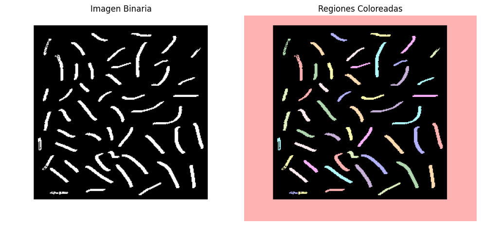

### 4. (*) Cálculo de propiedades geométricas. Extraer área, perímetro, excentricidad y compacidad de cada región segmentada. Sugerencia: regionprops de skimage.measure.

Se utilizó la función `regionprops` de `skimage.measure` para calcular las propiedades geométricas de las regiones segmentadas. Esta función devuelve una lista de objetos que contienen diversas propiedades de cada región, como el área, el perímetro, la excentricidad y la compacidad.

```python
label_image = measure.label(binary_image)
props = measure.regionprops(label_image)
for prop in props:
    area = prop.area
    perimeter = prop.perimeter
    eccentricity = prop.eccentricity
    compactness = (perimeter ** 2) / area if area > 0 else 0    
```

Se muestran los reusltado para la siguiente imágen:

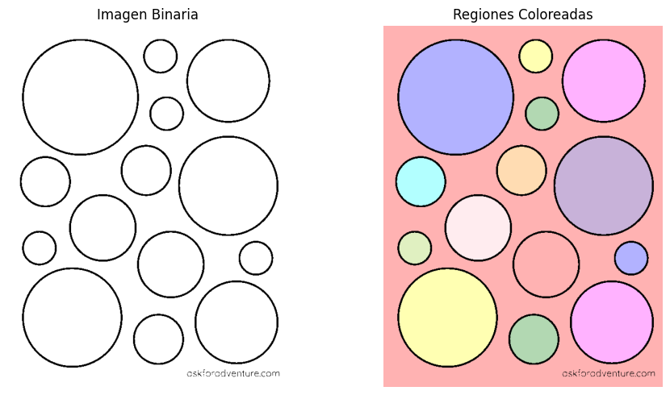

```bash
Región 1: Area=187418.0, Perimeter=9535.681092190353, Eccentricity=0.64, Compactness=485.17
Región 2: Area=40881.0, Perimeter=753.3523804664972, Eccentricity=0.03, Compactness=13.88
Región 3: Area=3067.0, Perimeter=203.8233764908628, Eccentricity=0.09, Compactness=13.55
Región 4: Area=20596.0, Perimeter=533.8721497261419, Eccentricity=0.04, Compactness=13.84
Región 5: Area=3066.0, Perimeter=203.8233764908628, Eccentricity=0.09, Compactness=13.55
Región 6: Area=29861.0, Perimeter=643.0264786586926, Eccentricity=0.05, Compactness=13.85
Región 7: Area=7182.0, Perimeter=314.14927829866735, Eccentricity=0.07, Compactness=13.74
Región 8: Area=7181.0, Perimeter=314.3919189857867, Eccentricity=0.05, Compactness=13.76
Región 9: Area=13007.0, Perimeter=422.47518010647184, Eccentricity=0.03, Compactness=13.72
Región 10: Area=3065.0, Perimeter=205.23759005323595, Eccentricity=0.07, Compactness=13.74
Región 11: Area=13017.0, Perimeter=424.71782079359116, Eccentricity=0.04, Compactness=13.86
Región 12: Area=3071.0, Perimeter=203.82337649086284, Eccentricity=0.09, Compactness=13.53
Región 13: Area=29873.0, Perimeter=643.6122650963194, Eccentricity=0.03, Compactness=13.87
Región 14: Area=20575.0, Perimeter=533.0437226013956, Eccentricity=0.05, Compactness=13.81
Región 15: Area=7181.0, Perimeter=314.97770542341357, Eccentricity=0.06, Compactness=13.82
```


### 6. (*) Descriptores de textura con GLCM. Calcular contraste, correlación y homogeneidad de regiones usando matrices de co-ocurrencia. skimage.feature.greycomatrix, greycoprops.

Para este ejercicio se utilizó la función `graycomatrix` de `skimage.feature` para calcular la matriz de co-ocurrencia de una imagen en escala de grises. Luego, se aplicó `graycoprops` para extraer los descriptores de textura como contraste, correlación y homogeneidad.

```python
# Compute the Gray-Level Co-occurrence Matrix (GLCM)
glcm = graycomatrix(image_uint8, 
                    distances=[1], 
                    angles=[0], 
                    levels=256,
                    symmetric=True, 
                    normed=True)

# Extract texture properties
contrast = graycoprops(glcm, 'contrast')[0, 0]
correlation = graycoprops(glcm, 'correlation')[0, 0]
homogeneity = graycoprops(glcm, 'homogeneity')[0, 0]
```

A continuación se muestran algunos resultados obtenidos:

### Imágen 1

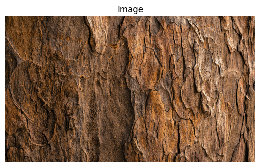

```bash
Contrast:     17806.4886
Correlation:  0.4394
Homogeneity:  0.7262
```

### Imágen 2
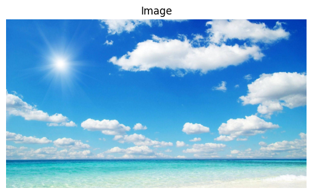
    
```bash 
Contrast:     695.0470
Correlation:  0.9786
Homogeneity:  0.9893
```

### Imágen 3
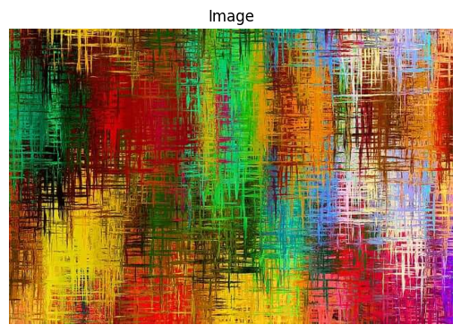

```bash
Contrast:     9153.1955
Correlation:  0.7157
Homogeneity:  0.8592
```

### 8. (*) Relación espacial entre regiones. Determinar si las regiones están adyacentes o si una está contenida en otra. skimage.measure.regionprops + análisis de coordenadas / bounding boxes.

Se implemetó un algoritmo que utiliza las propiedades de las regiones obtenidas con `regionprops` para determinar la relación espacial entre ellas. Se verifica si dos regiones son adyacentes o si una está contenida dentro de otra comparando sus coordenadas y bounding boxes.

```python
def check_containment(bbox1, bbox2):
    """Check if bbox2 is fully contained within bbox1."""
    return (bbox2[0] >= bbox1[0] and bbox2[1] >= bbox1[1] and
            bbox2[2] <= bbox1[2] and bbox2[3] <= bbox1[3])

def check_adjacency(mask1, mask2):
    """Check if two regions are adjacent using morphological dilation."""
    # Determine the maximum shape for padding
    max_rows = max(mask1.shape[0], mask2.shape[0])
    max_cols = max(mask1.shape[1], mask2.shape[1])

    # Pad both masks to the same shape
    padded_mask1 = np.zeros((max_rows, max_cols), dtype=bool)
    padded_mask2 = np.zeros((max_rows, max_cols), dtype=bool)

    padded_mask1[:mask1.shape[0], :mask1.shape[1]] = mask1
    padded_mask2[:mask2.shape[0], :mask2.shape[1]] = mask2

    # Dilate the first padded mask
    dilation_structure = np.ones((10, 10), dtype=bool)  # 3x3 square structuring element
    dilated1 = binary_dilation(padded_mask1, structure=dilation_structure)

    # Check for adjacency
    return np.any(dilated1 & padded_mask2)
```

Un ejemplo de los resultados obtenidos es el siguiente:

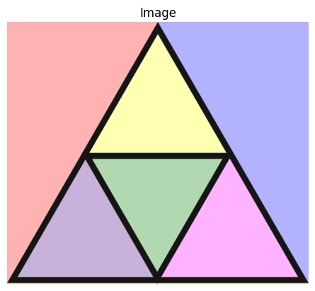

```bash
Region 1 is adjacent to Region 2
Region 1 contains Region 6
Region 1 is adjacent to Region 7
Region 2 contains Region 4
Region 2 is adjacent to Region 7
```

## Sección 2: Reconocimiento de patrones

### 1. (*) Template Matching. Buscar una figura conocida dentro de una imagen mediante una plantilla. Sugerencia: cv2.matchTemplate, cv2.minMaxLoc.

```python
image = cv2.imread('images/pokemones.jpg', 0)
template = cv2.imread('images/charmander.png', 0)

show_image("Original Image", image)
show_image("Template Image", template)

result = cv2.matchTemplate(image, template, cv2.TM_CCOEFF_NORMED)
min_val, max_val, min_loc, max_loc = cv2.minMaxLoc(result)

top_left = max_loc
h, w = template.shape
bottom_right = (top_left[0] + w, top_left[1] + h)

# Draw rectangle (use a copy to avoid modifying the original)
image_rect = image.copy()
cv2.rectangle(image_rect, top_left, bottom_right, 0, 2)

plt.imshow(image_rect, cmap='gray')
plt.title('Template Matching Result')
plt.axis('off')
plt.show()
```

imagen original:  
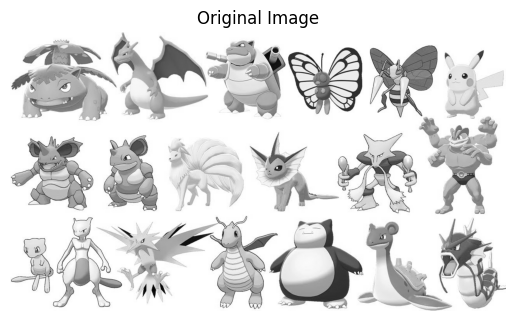  
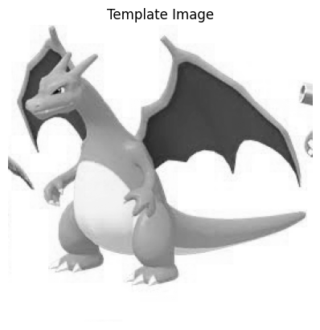  
resultados:   
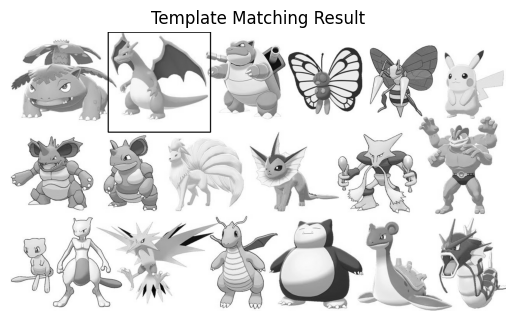  

Utilizamos matchTemplate para ver si en la imagen está presente el template y después utilizamos minMaxLoc para localizar donde está el template según el resultado anterior, para después dibujarle un cuadrado.

### 2. (*) Clasificación basada en características. Extraer características simples (como área o textura) de regiones segmentadas y clasificarlas usando KNN. Sugerencia: scikit-learn + descriptores de regionprops.

imagen original:  
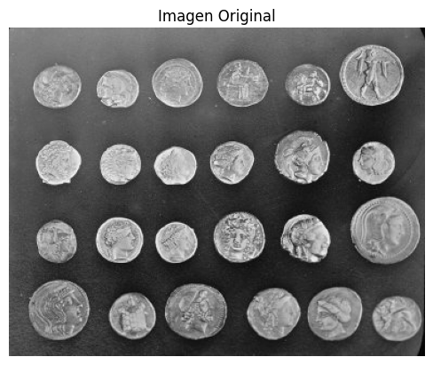
resultado:  
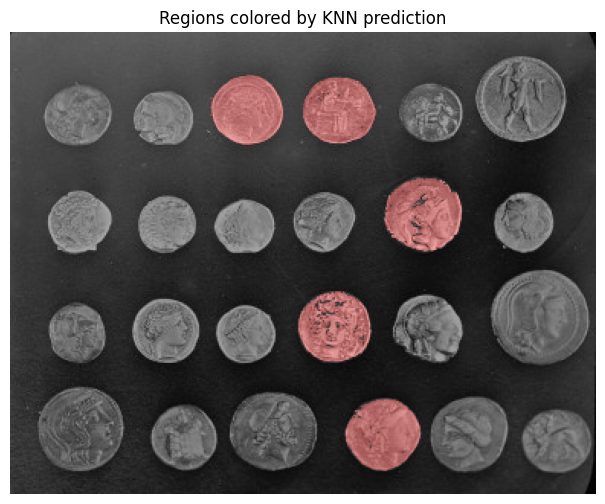  

```bash
area  eccentricity  mean_intensity
0   8755.0      0.975574      127.037807
1   2459.0      0.329384      160.939406
2   1684.0      0.295118      168.416865
3   1631.0      0.386946      157.508277
4   1193.0      0.391733      155.857502
5   1133.0      0.425931      182.796999
6   1834.0      0.373905      161.767176
7   1325.0      0.341981      189.298113
8   1203.0      0.378973      172.445553
9   1133.0      0.333174      173.221536
10  1129.0      0.347995      190.038973
11  1104.0      0.444839      192.940217
12  3054.0      0.305640      151.196464
13  1633.0      0.303620      163.419473
14  1352.0      0.485358      169.458580
15  1461.0      0.258136      173.733060
16  1095.0      0.075756      155.792694
17  1148.0      0.251343      177.599303
18  2099.0      0.240961      136.565984
19  1954.0      0.420332      138.266633
20  1918.0      0.427326      146.826382
21  1728.0      0.335667      153.210648
22  1312.0      0.373290      156.836128
23  1462.0      0.416847      154.549932

Accuracy: 0.625
              precision    recall  f1-score   support

           0       0.71      0.83      0.77         6
           1       0.00      0.00      0.00         2

    accuracy                           0.62         8
   macro avg       0.36      0.42      0.38         8
weighted avg       0.54      0.62      0.58         8
```

Encontramos area, centroide y intensidad media de cada area y clasificamos con knn.

### 5. (*) Reconocimiento estructural. Representar caracteres como grafos de líneas y nodos. Clasificarlos según su estructura. Sugerencia: Estructuras de grafos con networkx (librería de python).

imagen original:  
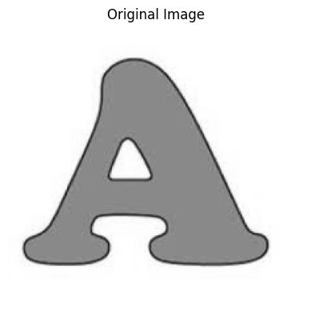
Resultados:  
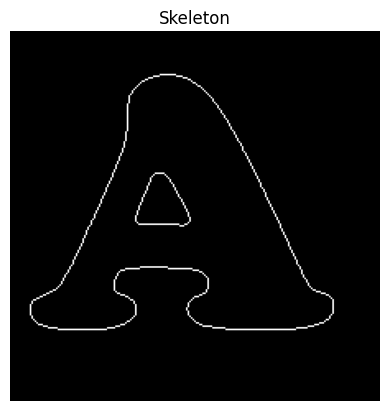  
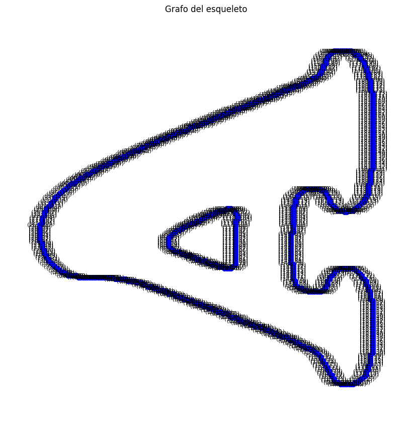  

Transformamos un caracter en grafo utilizando networkx

### 6. (*) Clasificación con CNN (Deep Learning). Construir una red neuronal convolucional para clasificar dígitos (MNIST o similar). Sugerencia: TensorFlow o PyTorch + torchvision.datasets.MNIST.


Resultado:
```bash
┏━━━━━━━━━━━━━━━━━━━━━━━━━━━━━━━━━┳━━━━━━━━━━━━━━━━━━━━━━━━┳━━━━━━━━━━━━━━━┓
┃ Layer (type)                    ┃ Output Shape           ┃       Param # ┃
┡━━━━━━━━━━━━━━━━━━━━━━━━━━━━━━━━━╇━━━━━━━━━━━━━━━━━━━━━━━━╇━━━━━━━━━━━━━━━┩
│ conv2d (Conv2D)                 │ (None, 26, 26, 32)     │           320 │
├─────────────────────────────────┼────────────────────────┼───────────────┤
│ max_pooling2d (MaxPooling2D)    │ (None, 13, 13, 32)     │             0 │
├─────────────────────────────────┼────────────────────────┼───────────────┤
│ conv2d_1 (Conv2D)               │ (None, 11, 11, 64)     │        18,496 │
├─────────────────────────────────┼────────────────────────┼───────────────┤
│ max_pooling2d_1 (MaxPooling2D)  │ (None, 5, 5, 64)       │             0 │
├─────────────────────────────────┼────────────────────────┼───────────────┤
│ conv2d_2 (Conv2D)               │ (None, 3, 3, 64)       │        36,928 │
├─────────────────────────────────┼────────────────────────┼───────────────┤
│ flatten (Flatten)               │ (None, 576)            │             0 │
├─────────────────────────────────┼────────────────────────┼───────────────┤
│ dense (Dense)                   │ (None, 64)             │        36,928 │
├─────────────────────────────────┼────────────────────────┼───────────────┤
│ dense_1 (Dense)                 │ (None, 10)             │           650 │
└─────────────────────────────────┴────────────────────────┴───────────────┘

 Total params: 93,322 (364.54 KB)
 Trainable params: 93,322 (364.54 KB)
 Non-trainable params: 0 (0.00 B)

Epoch 1/5
938/938 ━━━━━━━━━━━━━━━━━━━━ 71s 69ms/step - accuracy: 0.8721 - loss: 0.4027
Epoch 2/5
938/938 ━━━━━━━━━━━━━━━━━━━━ 64s 68ms/step - accuracy: 0.9847 - loss: 0.0508
Epoch 3/5
938/938 ━━━━━━━━━━━━━━━━━━━━ 64s 68ms/step - accuracy: 0.9899 - loss: 0.0318
Epoch 4/5
938/938 ━━━━━━━━━━━━━━━━━━━━ 64s 68ms/step - accuracy: 0.9927 - loss: 0.0221
Epoch 5/5
938/938 ━━━━━━━━━━━━━━━━━━━━ 82s 69ms/step - accuracy: 0.9944 - loss: 0.0183
<keras.src.callbacks.history.History at 0x130004e6660>
```

Construimos una red neuronal y la ejecutamos por 5 epocas obteniendo 0.99 de accuracy para los numeros predecidos.