# Trabajo Practico 1
**Alumnos:**  
Nahuel Arrieta  
Lucas Moyano

## Sección 1
1. **Utilizando openCV en python, cargar una imagen RGB y mostrarla en una ventana utilizando el comando imread() y imshow(), tambien puede utilizar matplotlib para mostrarla.**

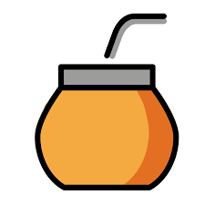

2. **Una vez cargada la imagen de muestra podemos empezar usando numpy y su función array para obtener el arreglo de valores de intensidad para cada uno de los canales de color.**

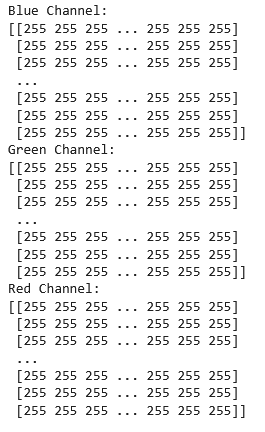

3. **Retomando con el ejercicio 1, analizar la imagen cargada ¿Existe algún problema con los colores mostrados con respecto a la imagen original?**

Sí, los valores de los colores rojo y azul parecen estar intercambiados. Esto ocurre porque opencv interpreta las imágenes en BGR en lugar de RGB.

4. **Cargar la imagen pero antes de mostrarla utilizar el comando cvtColor(). ¿Que sucede ahora?**

  
Los valores impresos por pantalla ahora se muestran correctamente porque cambiamos el formato de BGR a RGB. Sin embargo, cuando mostramos la imagen opencv espera que los colores estén en BGR y se ven los colores rojo y azul invertidos.

5. **Utilizar la función split() para una imagen RGB y separar en canales**

Red channel:  
  
Green channel:  
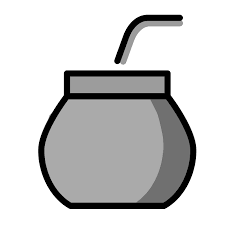  
Blue channel:  
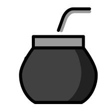  

6. **(*) La conversión de una imagen de color a escala de grises se puede hacer de varias formas. El ejercicio consiste en convertir la imagen de Lenna color a escala de grises utilizando diferentes metodos.**

a. **Usando la libreria cv2 y el metodo cvtColor()**

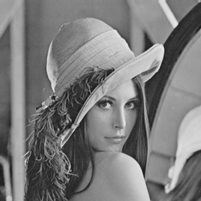

b. **Usando la fórmula de luminancia**

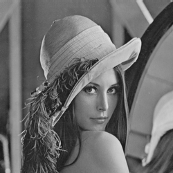

c. **Usando scickit-image y el método rgb2gray**

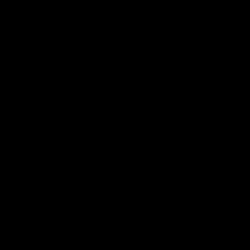

d. **¿Qué pasa con los canales?**

Ahora las imágenes solo tienen un único canal que corresponde, a la intensidad del blanco.

e. **¿Qué profundidad de bits tiene la imagen?**

Tienen una profundidad de 8 bits.

f. **Evaluar con otra imagen de mayor profundidad**

g. **¿Qué sucede con la imagen? ¿Ha cambiado algo?**

Al ojo humano, parece no haber diferencia entre una profundidad de bits de 8 y una de 16.

7. **(*) Convertir la imagen de Lenna a otros modos de color, como CMYK, HSV, HSL. Mostrar el resultado.**

CMYK:
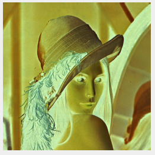
HSV:
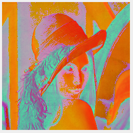
HSL:
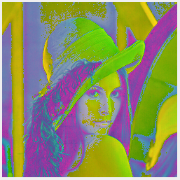

8. **(*) Tomar la imagen convertida en escala de grises y volver a convertir al en modo RGB. ¿Qué ha sucedido?**

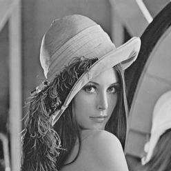  
Cuando se convirtió a escala de grises, se perdió información respectiva a la intensidad de cada color. Cuando volvemos a convertir a RGB, se aplica la misma información a todos los canales, perdiendo toda diferencia entre intensidad de colores.

9. **Cargar una imagen en color con OpenCV. Extrae los valores de un píxel en la posición (x, y). Modifica un área de la imagen (por ejemplo, convierte una región a rojo puro). Divide la imagen en sus tres canales de color (B, G, R) y muestra cada uno por separado**

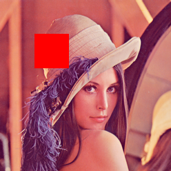  
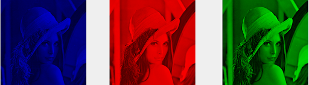

## Sección 2

1. **¿El formato BMP es un formato de compresion?**

No, BMP guarda los valores de cada uno de los píxeles directamente en el archivo, sin aplicar técnicas de compresión. Esto que genera archivos más grandes en comparación con otros formatos que usan compresión.

2. **(*) Dar detalles de las siguientes métricas de calidad de compresión (PSNR, SSIM)**

*PNSR  (Peak Signal-to-Noise Ratio)*  
El PSNR es una métrica utilizada para evaluar la calidad de una imagen comprimida en comparación con la imagen original. Se basa en la relación entre la potencia máxima de la señal (la imagen original) y la potencia del ruido (la diferencia entre la imagen original y la imagen comprimida).  
Se  calcula:  
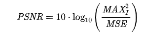  
Donde:  
- MAXI es el valor máximo de un píxel (para imágenes en escala de grises con 8 bits, MAXI  =255).
- MSE es el Mean Squared Error, que mide la diferencia promedio entre los píxeles de la imagen original y la imagen comprimida.

*SSIM (Structural Similarity Index)*  
El SSIM es una métrica más avanzada y perceptual que evalúa la calidad de una imagen teniendo en cuenta la estructura visual que es importante para el ojo humano. Mide las similitudes en la luminancia, el contraste y la estructura de las imágenes comparadas. Se calcula:  
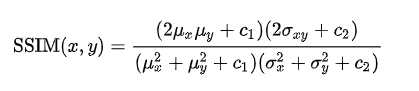  

3. **¿Cual es el impacto de la compresión en el procesamiento posterior de una imagen?**

La compresión (en el caso de ser con pérdida de información) reduce el tamaño del archivo a costa de eliminar detalles de la imagen, lo que puede afectar negativamente el procesamiento posterior, especialmente en tareas como la segmentación, la detección de patrones y la mejora de imágenes, ya que introduce artefactos visuales y pierde precisión.

4. **Cargar una imagen en color. Guarda la imagen con diferentes niveles de calidad (ejemplo: 90%, 50%, 10%). Comparar el tamaño, resolución, calidad, profundidad de bits de los archivos y la pérdida de calidad. ¿Que puede comentar de las imágenes resultantes?**

Resultados:

90%:

50%:

10%
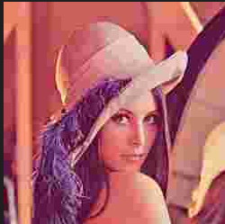

Conclusiones:
- **Tamaño del archivo:** A medida que disminuye la calidad de compresión, el tamaño del archivo se reduce. 
- **Resolución**: La resolución no cambia con la compresión; lo que varía es la precisión de los valores de los píxeles. La imagen comprimida tiene la misma cantidad de píxeles, pero los detalles de color se ven afectados.
- **Calidad Visual**: Con calidad alta (90%), la diferencia con la imagen original es casi imperceptible. A medida que baja la calidad, los artefactos de compresión, como los bloques y la pérdida de detalles, se vuelven más evidentes.
- **Profundidad de Bits**: La profundidad de bits permanece constante (8 bits) durante la compresión. 

5. **Guardar una imagen en formato PNG con distintos niveles de compresión (0 a 9). Comparar el tamaño de los archivos generados.**  

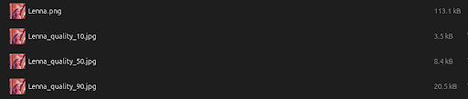

6. **(*) Implementar un modelo de compresión basado en codificación Run-Length Encoding (RLE). El algoritmo Run-Length Encoding (RLE) reduce el tamaño de una imagen representando secuencias consecutivas de píxeles idénticos como una sola entrada. Para ello convertir una imagen en escala de grises. luego, implementar el algoritmo RLE para comprimir la imagen. Posteriormente, implementar una funcion para descomprimir la imagen. Al finalizar, mostrar la imagen original y la imagen reconstruida. Probar con dos o tres imagenes que tengan diferentes características, modos de color. Utilizar alguna de las metricas nombradas anteriormente e evaluar el resultado de la misma.**

Imagenes originales:  
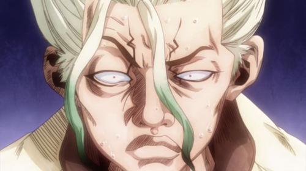
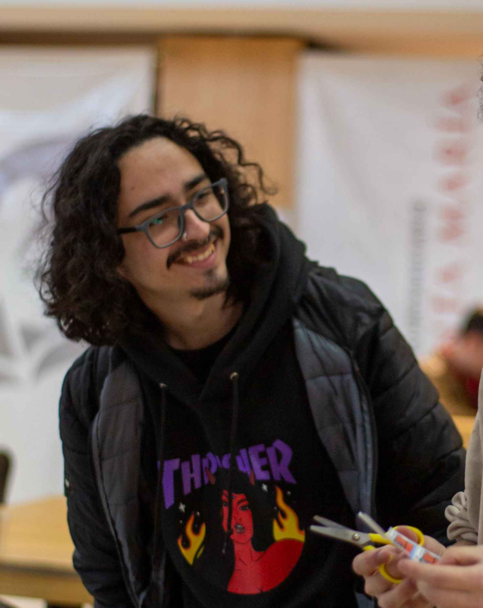  
Imagenes greyscale:  
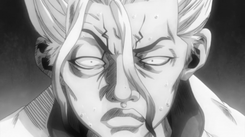
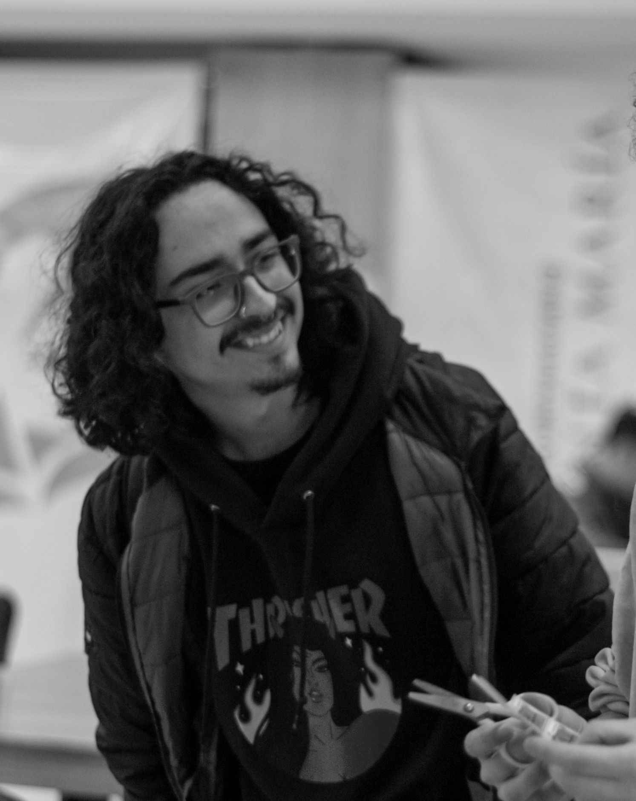  
Imagenes reconstruidas:  

Utilizando PSNR notamos que nos da infinito, ya que las imagenes no pierden datos y son identicas.